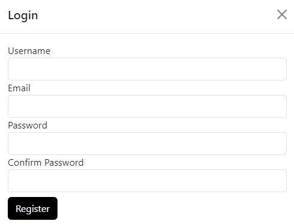
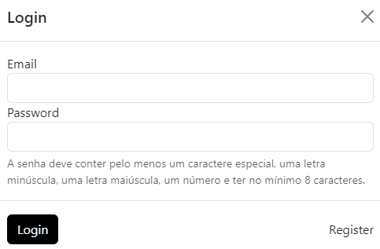
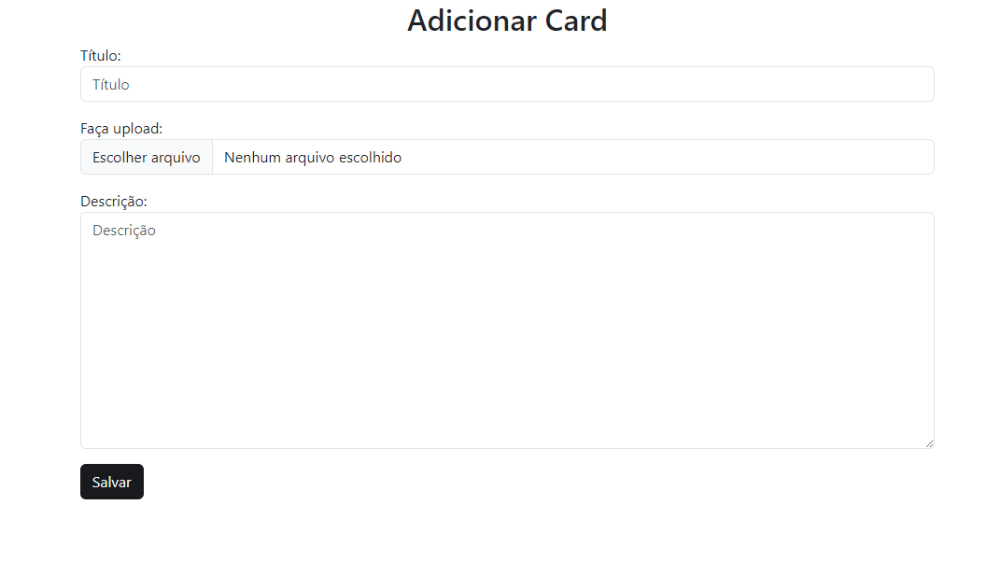
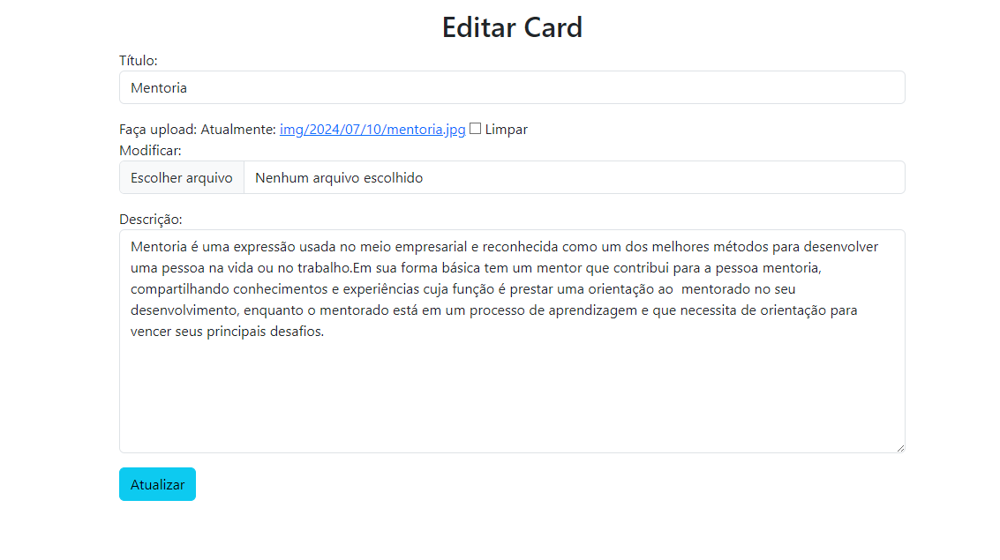

# Venture Vision - Documentação Geral 
- O Sistema
- Requerimentos mínimos
   1. Hardware 
   2. Software
- Principais funções
   1. Cadastro
   2. Login
   3. Logout
   4. Adicionar Cards
   5. Editar Cards
   6. Excluir cards
- Restrição

# O Sistema

O sistema Venture Vision tem como finalidade apresentar taticas empresarias, para os usuarios que estão no inicio de sua carrera

# Requerimentos míninos

## - Hardware
- Processador i5 da 5a geração em diante
- Memória RAM de 8 GB
- HD / SSD de pelo menos 1 TB
- Acesso via Internet
## - Software
- Sistema Operacional Windows 10 Professional ou Distribuição Linux equivalente (Debian, Mint, - - Ubuntu, entre outras)
- Python Versão 3.10(ou superior)
  - Django Versão 5.0.6
  - Mysqlclient Versão 2.2.4
  - Pillow Versão 10.3.0
  - Sqlparse Versão 0.5.0
  - Tzdata Versão 2024.1
  - Asgiref Versão 3.8.1
- Servidor de Banco de Dados MySQL versão 5.5. (MariaDB 10.4.41)

# Principais funções

## - Cadastro

Opção feita para o cadastro do usuário, necessitando de email, username, senha e confirmação da senha.

## - Login

Opção feita para o login do usuário, com campos de inserção do email e da senha.

## - Logout

Botão para o logout do usuário.

## - Adicionar Cards

Aba para adição de cards, com campos obrigatórios da imagem, título e conteúdo.

## - Editar Cards

Aba para a edição dos cards.

## - Excluir Cards

Botão para exclusão de cards.

# Restrições

O sistema so permite adicionar, editar e remover cards a conta logada no site.

